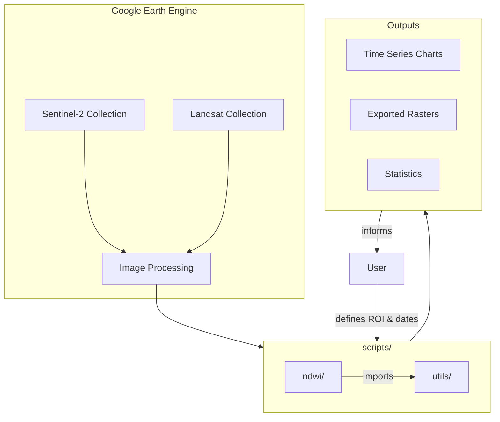

# agr1model


Water resource monitoring through NDWI (Normalized Difference Water Index) analysis using satellite imagery for climate modeling and agricultural planning.

## Why This Exists

Agricultural regions face increasing uncertainty due to climate variability. Water availability directly impacts crop yields, irrigation planning, and drought preparedness. Traditional ground-based monitoring is expensive and limited in coverage.

This project leverages Google Earth Engine's petabyte-scale satellite archive to analyze water body dynamics across agricultural regions. By computing NDWI from Sentinel-2 and Landsat imagery, it enables:

- **Early drought detection** through temporal water index trends
- **Irrigation planning** based on historical water availability patterns
- **Climate impact assessment** for agricultural decision-making

## Architecture



## Engineering Decisions

| Decision | Rationale |
|----------|-----------|
| **Google Earth Engine** | Server-side processing eliminates local compute constraints; direct access to Sentinel-2/Landsat archives without download overhead |
| **JavaScript (GEE API)** | Native language for GEE Code Editor; enables rapid prototyping and sharing via script links |
| **NDWI over NDVI** | Water detection requires NIR/Green ratio (NDWI) rather than vegetation index; more sensitive to water body boundaries |
| **Sentinel-2 primary, Landsat fallback** | Sentinel-2 offers 10m resolution vs Landsat's 30m; Landsat provides longer historical archive (1984+) for trend analysis |
| **Modular utils/** | Reusable functions for filtering, masking, and exporting reduce code duplication across analysis scripts |

## Getting Started

### Prerequisites

- Active [Google Earth Engine account](https://signup.earthengine.google.com/)

### Running Scripts

1. Open [Google Earth Engine Code Editor](https://code.earthengine.google.com/)
2. Copy the desired script from `scripts/ndwi/`
3. Paste into the editor
4. Define your Region of Interest (ROI) and date range
5. Click **Run**

```javascript
// Example: Define ROI and date range
var roi = ee.Geometry.Rectangle([-50.5, -23.5, -49.5, -22.5]);
var startDate = '2024-01-01';
var endDate = '2024-12-31';
```

## Project Structure

```
agr1model/
├── scripts/
│   ├── ndwi/          # NDWI calculation and analysis scripts
│   └── utils/         # Shared utility functions
├── docs/              # Technical documentation and references
├── data/              # Sample data and exported results
├── .claude/           # AI agent configuration and rules
└── README.md
```

## License

This project is licensed under the terms specified in [LICENSE](LICENSE).
